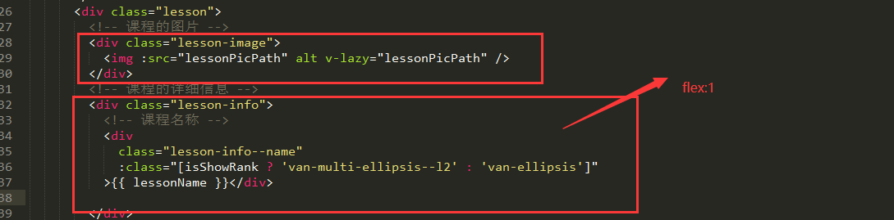

# Ellipsis

---

当文本内容长度超过容器最大宽度时，自动省略多余的文本。

### 1. 作为辅助类

:::demo

```html
<template>
  <!-- 最多显示一行 -->
  <div class="ufin-box">
    <div class="ufin-ellipsis">
      这是一段最多显示一行的文字，多余的内容会被省略。这是一段最多显示一行的文字，多余的内容会被省略。这是一段最多显示一行的文字，多余的内容会被省略。这是一段最多显示一行的文字，多余的内容会被省略。这是一段最多显示一行的文字，多余的内容会被省略。这是一段最多显示一行的文字，多余的内容会被省略。这是一段最多显示一行的文字，多余的内容会被省略。
    </div>
  </div>
  <!-- 最多显示两行 -->
  <div class="ufin-box">
    <div class="ufin-ellipsis--l2">
      这是一段最多显示两行的文字，多余的内容会被省略.这是一段最多显示两行的文字，多余的内容会被省略.这是一段最多显示两行的文字，多余的内容会被省略.这是一段最多显示两行的文字，多余的内容会被省略.这是一段最多显示两行的文字，多余的内容会被省略.这是一段最多显示两行的文字，多余的内容会被省略.这是一段最多显示两行的文字，多余的内容会被省略.这是一段最多显示两行的文字，多余的内容会被省略.这是一段最多显示两行的文字，多余的内容会被省略.这是一段最多显示两行的文字，多余的内容会被省略
    </div>
  </div>

  <!-- 最多显示三行 -->
  <div class="ufin-box">
    <div class="ufin-ellipsis--l3">
      这是一段最多显示三行的文字，多余的内容会被省略。这是一段最多显示三行的文字，多余的内容会被省略。这是一段最多显示三行的文字，多余的内容会被省略。这是一段最多显示三行的文字，多余的内容会被省略。这是一段最多显示三行的文字，多余的内容会被省略。这是一段最多显示三行的文字，多余的内容会被省略。这是一段最多显示三行的文字，多余的内容会被省略。这是一段最多显示三行的文字，多余的内容会被省略。这是一段最多显示三行的文字，多余的内容会被省略。这是一段最多显示三行的文字，多余的内容会被省略。这是一段最多显示三行的文字，多余的内容会被省略。这是一段最多显示三行的文字，多余的内容会被省略。这是一段最多显示三行的文字，多余的内容会被省略。这是一段最多显示三行的文字，多余的内容会被省略。这是一段最多显示三行的文字，多余的内容会被省略。这是一段最多显示三行的文字，多余的内容会被省略。这是一段最多显示三行的文字，多余的内容会被省略。这是一段最多显示三行的文字，多余的内容会被省略。这是一段最多显示三行的文字，多余的内容会被省略。这是一段最多显示三行的文字，多余的内容会被省略。这是一段最多显示三行的文字，多余的内容会被省略。这是一段最多显示三行的文字，多余的内容会被省略。
    </div>
  </div>
</template>
```

:::

### 作为 mixins

```scss
// 单行省略
@include utils-ellipsis();
// 省略指定行数
@include utils-ellipsis--rows(rowNumber);
```

1. examples

```css
.p {
  @include utils-ellipsis();
}
```

## 注意：

1. 在 flex 布局中，我们经常使用 flex:1 去定义主体内容，但是在主体内容下如标题的省略，发现没有效果。



这时候我们需要做的是讲 flex:1; 的元素添加一个属性 **width: 0;**
